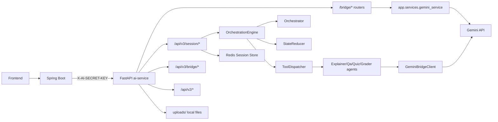
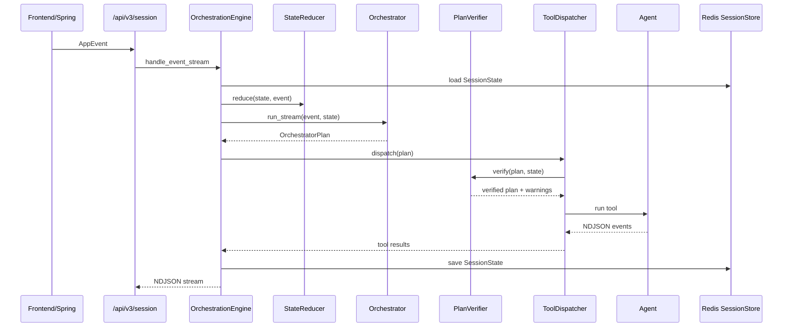

# AI Service Architecture

작성일: 2026-05-09

## 개요

`ai-service`는 Spring Boot 백엔드와 연동되는 FastAPI 기반 AI 서비스다. 현재 구조는 다음 세 흐름을 동시에 유지한다.

- v3 학습 세션 오케스트레이션: `/api/v3/session/*`
- Spring bridge 단건/스트리밍 AI 기능: `/bridge/*`
- 기존 v2 classic 기능: `/api/v2/*`

Spring 신규 기능 연동의 최종 계약은 `/bridge/*`로 고정한다. `/api/v3/*`는 FastAPI 내부 기능 API 또는 직접 테스트/확장용으로 유지한다.

## 상위 구조



## Layer 역할

### FastAPI App

파일:

- `app/main.py`

역할:

- FastAPI 앱 생성
- router 등록
- `X-AI-SECRET-KEY` 인증 middleware
- CORS allowlist 적용
- validation error handler
- health check

운영 정책:

- `APP_ENV=prod|production` 또는 `ENV=prod|production`이면 `AI_SECRET_KEY`가 필수다.
- secret이 없거나 placeholder면 앱 시작이 실패한다.

### Bridge Routers

파일:

- `app/routers/bridge_agents.py`
- `app/routers/report.py`
- `app/routers/exam.py`

역할:

- Spring이 직접 호출하는 `/bridge/*` 계약 제공
- 학생 리포트, 시험 스튜디오, 토론 보조, 리포트 기준 추천, 강의실 리포트 처리
- NDJSON streaming 응답 표준화
- fallback 결과 표시

Spring 호출 기준:

| 기능 | Endpoint |
|---|---|
| Discussion AI Assistant | `POST /bridge/discussion_assistant_stream` |
| Exam Studio PDF Context | `POST /bridge/exam_studio/pdf_context` |
| Exam Studio Chat | `POST /bridge/exam_studio/chat_stream` |
| Teacher Exam Grade | `POST /bridge/exam/grade` |
| Student Report Chatbot | `POST /bridge/report/student_chat_stream` |
| Report Criteria AI 추천 | `POST /bridge/report/criteria_assistant_stream` |
| Classroom 종합 리포트 | `POST /bridge/report/classroom_analyze` |
| Classroom 종합 리포트 Stream | `POST /bridge/report/classroom_analyze_stream` |

### Gemini Service

파일:

- `app/services/gemini_service.py`

역할:

- Gemini client 생성 공통화
- client cache 적용
- sync Gemini SDK 호출을 `asyncio.to_thread`로 분리
- JSON/text 응답 생성 공통 함수 제공
- Gemini JSON 응답 파싱 공통화

이 레이어는 bridge agent API에서 직접 사용한다.

### V3 Session Engine

파일:

- `ai_agent/v3/engine/OrchestrationEngine.py`
- `ai_agent/v3/engine/Orchestrator.py`
- `ai_agent/v3/engine/StateReducer.py`
- `ai_agent/v3/engine/ToolDispatcher.py`
- `ai_agent/v3/engine/PlanVerifier.py`

역할:

- 프론트 이벤트 수신
- 세션 상태 선반영
- LLM planner 실행
- planner output 검증 및 soft patch
- tool action dispatch
- NDJSON stream 반환
- Redis session state 저장

흐름:



### V3 Agents

파일:

- `ai_agent/v3/agents/ExplainerAgent.py`
- `ai_agent/v3/agents/QaAgent.py`
- `ai_agent/v3/agents/QuizAgents.py`
- `ai_agent/v3/agents/GraderAgent.py`
- `ai_agent/v3/agents/MisconceptionRepairAgent.py`

역할:

- 페이지 설명
- 현재 페이지 기반 QA
- 퀴즈 생성
- 퀴즈 채점
- 오개념 교정 설명

최근 변경:

- `ExplainerAgent` prompt에서 페이지 이동마다 반복 인사/도입이 나오지 않도록 제한했다.
- 설명 첫 문장을 `## 핵심 요지`로 시작하도록 유도한다.
- 설명 생성은 우선 현재/이전/다음 페이지 텍스트를 읽어 레퍼런스 스타일 prompt로 실행한다.
- page text 추출 실패 시 기존 Gemini PDF 전체 입력 방식으로 fallback한다.
- 레퍼런스 스타일 prompt에는 한국어 출력, 현재 페이지 집중, LaTeX/코드 포맷, 핵심 개념 굵게 표시 규칙을 유지한다.

### Plan Verifier

파일:

- `ai_agent/v3/engine/PlanVerifier.py`

역할:

- LLM planner가 만든 `OrchestratorPlan`을 tool 실행 전에 검증한다.
- Spring 연동 안정성을 우선해 soft safety layer로 동작한다.
- malformed `CALL_TOOL` action, 과도한 action, intervention budget 초과 action을 실행 전 제거한다.
- `PedagogyPolicy`가 직접 답변 금지, HOLD_BACK 등을 표시하면 `plan_verification_warnings`에 남긴다.
- `active_intervention`이 있는 상태에서 다음 `USER_MESSAGE`가 들어오면 일반 `ANSWER_QUESTION` 대신 `REPAIR_MISCONCEPTION`을 우선 실행한다.
- repair 자동 주입은 현재 페이지의 활성 오개념 교정 상태가 있을 때만 동작한다.

현재 제한:

- 전체 action hard cap: 8개
- intervention tool budget: `pedagogy_policy.intervention_budget`, 최대 8개
- 검증 경고는 `SessionState.plan_verification_warnings`에 최근 20개만 유지한다.

### Quiz Diagnosis And Repair

파일:

- `ai_agent/v3/engine/QuizDiagnosisService.py`
- `ai_agent/v3/agents/MisconceptionRepairAgent.py`

흐름:

1. `AUTO_GRADE_MCQ_OX` 또는 `GRADE_SHORT_OR_ESSAY`가 완료되면 `ToolDispatcher`가 채점 결과를 `QuizDiagnosisService`에 전달한다.
2. 점수가 `PASS_SCORE_RATIO=0.6` 미만이면 `quiz_assessments[]`에 `PENDING` artifact를 저장한다.
3. 같은 시점에 `SessionState.active_intervention`을 생성한다.
4. 다음 planner prompt에는 pending assessment digest가 포함되고, artifact 상태는 `CONSUMED`로 바뀐다.
5. 활성 교정 상태에서 학생이 `USER_MESSAGE`를 보내면 `PlanVerifier`가 `REPAIR_MISCONCEPTION`을 우선 주입한다.
6. `MisconceptionRepairAgent`는 현재 페이지 텍스트, 오답 진단, 학생 메시지를 바탕으로 한국어 Markdown 교정 설명을 생성한다.
7. repair 완료 후 `ToolDispatcher`는 `RETEST_DECISION` 위젯을 반환한다.

외부 계약:

- `/api/v3/session/*` NDJSON shape는 유지한다.
- 채점 `done.data`에는 기존 `grading`, `passed` 외에 `quizAssessment`, `activeIntervention`이 추가될 수 있다.
- repair 완료 `done.data.ui.widget`은 `RETEST_DECISION`이다.
- repair agent가 error를 내거나 빈 답변을 반환하면 intervention을 `COMPLETED`로 바꾸지 않고 재시도 가능한 상태로 유지한다.
- repair stream 내부 `done`은 숨기고, UI patch가 포함된 최종 `done`만 클라이언트에 전달한다.
- Spring DB 스키마나 bridge DTO 변경은 필요하지 않다. 이 상태는 v3 session state 내부에 저장된다.

### Gemini Bridge Client

파일:

- `ai_agent/bridge/GeminiBridgeClient.py`

역할:

- v3 session agent들이 Gemini를 호출할 때 사용하는 bridge
- PDF 크기에 따라 Gemini 전달 방식을 자동 선택

PDF 처리 정책:

- 15MB 미만: `Part.from_bytes()` 사용
- 15MB 이상: Gemini File API 업로드
- File API URI는 Redis와 memory cache에 저장
- mtime 변경 시 재업로드
- 업로드 실패 시 bytes fallback

## Bridge 기능 상세

### Student Report

파일:

- `app/routers/report.py`
- `app/routers/bridge_agents.py`

구성:

- Spring이 DB에서 조회한 학생 리포트 context DTO를 FastAPI에 전달
- FastAPI는 DB를 직접 조회하지 않는다.
- Gemini 분석 실패 시 deterministic fallback 분석을 반환한다.

주요 endpoint:

- `POST /api/v3/report/student/analyze`
- `POST /api/v3/report/student/analyze/stream`
- `POST /api/v3/report/student/chat/stream`
- `POST /bridge/report/student_chat_stream`

Spring 연동 기준은 `/bridge/report/student_chat_stream`이다.

### Exam Studio

파일:

- `app/routers/exam.py`
- `app/routers/bridge_agents.py`

구성:

- 교사 자연어 요청을 시험 편집 operation으로 변환
- 시험 채점은 별도 `/api/v3/exam/grade`에서 제공

지원 operation:

- `patchExamSettings`
- `appendQuestions`
- `replaceQuestion`

operation 검증:

- `app/services/exam_studio_operation_validator.py`에서 LLM이 만든 operation을 정리한다.
- 지원하지 않는 operation, 빈 params, 잘못된 ISO 날짜, 빈 문항 추가, 잘못된 replace 요청은 제거하고 `warnings[]`에 사유를 남긴다.
- 문항 operation은 `prompt`, `type`, `points`를 검증하고, `points`는 0.5~100 범위로 보정한다.
- MCQ/OX는 정답이 필수다. MCQ `answer.choiceId`는 실제 choice id에 존재해야 하고, OX `answer.value`는 `O/X`로 정규화 가능해야 한다.
- SHORT/ESSAY는 reference answer 또는 rubric이 없으면 적용 가능한 문항으로 보지 않고 제거한다.
- 최종 operations는 최대 8개, `appendQuestions.params.questions`는 최대 50개로 제한한다.
- 변경 의도가 명확한 요청인데 실행 가능한 operation이 남지 않으면 `source=FALLBACK`, `reason=VALIDATION_ERROR`로 표시한다.

문항 생성 요청은 PDF/강의자료 context가 있을 때만 처리한다. FastAPI가 받은 `contextId` 캐시 텍스트 또는 `sourceText`가 없으면 문항을 만들지 않고 `operations=[]`, `fallbackUsed=true`, `reason=MISSING_CONTEXT`로 안내한다.

context가 있는데 Gemini가 빈 operation을 반환하면 FastAPI가 deterministic `appendQuestions` operation을 보정한다. 이 경우 `source=FALLBACK`, `fallbackUsed=true`, `reason=VALIDATION_ERROR`로 표시해 Spring/FE가 대체 생성 결과임을 구분할 수 있게 한다.

v3 학습 세션 퀴즈도 동일한 context gate를 적용한다. 현재 페이지 텍스트와 저장된 설명이 모두 없으면 `GENERATE_QUIZ_*`는 LLM을 호출하지 않고 `MISSING_CONTEXT` 안내와 빈 quiz를 반환한다.

주요 endpoint:

- `POST /bridge/exam_studio/pdf_context`
- `POST /bridge/exam_studio/chat_stream`
- `POST /bridge/exam/grade`
- `POST /api/v3/exam/studio/chat`
- `POST /api/v3/exam/studio/chat/stream`
- `POST /api/v3/exam/grade`

Spring 연동 기준은 `/bridge/exam_studio/*`와 `/bridge/exam/grade`이다.

### Discussion Assistant

파일:

- `app/routers/bridge_agents.py`

endpoint:

- `POST /bridge/discussion_assistant_stream`

역할:

- 토론 글 제목과 본문 초안 생성
- 강의명, 카테고리, 이전 초안, 최근 토론 글을 context로 사용
- 출력 후처리에서 중복 제목 heading, 인사말, assistant 자기소개 표현을 제거한다.
- 후처리로 수정된 내용은 `warnings[]`에 `DISCUSSION_*` 코드로 남긴다.

### Report Criteria Assistant

파일:

- `app/routers/bridge_agents.py`

endpoint:

- `POST /bridge/report/criteria_assistant_stream`

역할:

- 강의실 리포트 평가 기준 추천
- `criterion_suggestion` 이벤트로 추천 기준을 스트리밍
- 기존 criteria label과 중복되는 추천은 제거한다.
- 추천 weight는 최종 suggestions 합이 100이 되도록 재분배한다.
- AI 추천이 부족하면 fallback 기준으로 채우고 각 suggestion에 `source`, `fallbackUsed`, `reason`, `confidence`, `warnings[]`를 붙인다.

### Classroom Report

파일:

- `app/routers/bridge_agents.py`

endpoint:

- `POST /bridge/report/classroom_analyze`
- `POST /bridge/report/classroom_analyze_stream`

역할:

- 학생별 리포트와 평가 기준을 기반으로 강의실 종합 인사이트 생성

## NDJSON Streaming

Spring bridge streaming endpoint는 `application/x-ndjson`을 반환한다.

이벤트 타입:

- `thought_delta`
- `answer_delta`
- `criterion_suggestion`
- `done`
- `error`

표준 예시:

```json
{ "type": "thought_delta", "text": "분석 중입니다." }
{ "type": "answer_delta", "text": "..." }
{ "type": "done", "data": { "...": "..." } }
```

에러 예시:

```json
{
  "type": "error",
  "code": "REPORT_STUDENT_CHAT_FAILED",
  "message": "학생 리포트 채팅 응답 생성 중 오류가 발생했습니다.",
  "details": { "errorType": "AI_QUOTA" }
}
```

자세한 계약은 `BRIDGE_AGENT_ENDPOINTS.md`를 따른다.

## Fallback 정책

Gemini quota, timeout, validation 실패 등으로 AI 결과를 안정적으로 만들 수 없으면 deterministic fallback을 반환한다.

Fallback 표시 필드:

```json
{
  "source": "FALLBACK",
  "fallbackUsed": true,
  "reason": "AI_QUOTA",
  "confidence": "LOW"
}
```

정상 AI 결과:

```json
{
  "source": "AI",
  "fallbackUsed": false,
  "reason": null,
  "confidence": "MEDIUM"
}
```

Spring/FE는 `fallbackUsed`와 `source`를 기준으로 사용자에게 대체 결과임을 표시할 수 있다.

## PDF Context 구조

### 일반 업로드

파일:

- `app/routers/upload.py`

역할:

- 사용자가 업로드한 파일을 `uploads/`에 저장
- 저장된 path를 반환

### Exam Studio PDF Context

파일:

- `app/routers/bridge_agents.py`

endpoint:

- `POST /bridge/exam_studio/pdf_context`

입력:

- `pdfPath` 또는 `pdfText`

보안 정책:

- `pdfPath`는 FastAPI 프로세스 또는 FastAPI 컨테이너 filesystem 기준 경로
- `pdfPath`는 FastAPI의 `uploads/` 하위만 허용
- Spring과 FastAPI가 같은 volume mount를 공유하지 않으면 Spring 서버 로컬 경로를 넘길 수 없음
- 확장자는 `.pdf`만 허용
- 파일 header는 `%PDF-`로 검증
- 기본 최대 크기: `EXAM_STUDIO_PDF_CONTEXT_MAX_BYTES=52428800`
- `pdfText` 기본 최대 길이: `EXAM_STUDIO_PDF_TEXT_MAX_CHARS=500000`

캐시 정책:

- `contextId`는 process memory 기반 best-effort cache다.
- 기본 TTL은 `EXAM_STUDIO_CONTEXT_TTL_SECONDS=21600`이다.
- 서버 재시작, TTL 만료, 다중 worker 라우팅 변경 시 context가 사라질 수 있다.
- Spring은 context 미존재/만료 시 `pdf_context`를 재호출해 재생성해야 한다.

### Learning Session Page Context

파일:

- `app/services/pdf_context_service.py`

역할:

- 통합학습 설명 에이전트가 사용할 현재/이전/다음 페이지 텍스트를 추출한다.
- PDF mtime/size 기준으로 프로세스 메모리 cache를 유지한다.
- 추출 실패, 스캔 PDF, 빈 텍스트 PDF에서는 `None`을 반환하고 `ExplainerAgent`가 기존 PDF 전체 입력 fallback을 사용한다.

## 보안

### Inbound Secret

모든 Spring bridge 요청은 다음 헤더를 포함해야 한다.

```http
X-AI-SECRET-KEY: <AI_SECRET_KEY>
```

Spring WebClient 적용 방식은 `SPRING_BRIDGE_AUTH_INTEGRATION.md`를 따른다.

### Error And Log Safety

- 운영/공유 환경에서 request body 전체를 validation error 로그에 남기지 않는다.
- v3 session stream error는 raw exception 문자열 대신 stable `code`, 사용자 표시용 고정 `message`, `details.errorType`만 반환한다.
- tool execution failure도 내부 예외 메시지를 사용자 delta로 노출하지 않는다.

### CORS

CORS는 env 기반 allowlist를 사용한다.

- `CORS_ALLOWED_ORIGINS`
- `CORS_ALLOW_CREDENTIALS`

기본값은 local Spring/FE 개발 주소만 허용한다.

## 환경 변수

주요 env:

```bash
GEMINI_API_KEY=...
AI_SECRET_KEY=...
APP_ENV=local
CORS_ALLOWED_ORIGINS=http://localhost:8080,http://127.0.0.1:8080
CORS_ALLOW_CREDENTIALS=false
EXAM_STUDIO_CONTEXT_TTL_SECONDS=21600
EXAM_STUDIO_PDF_CONTEXT_MAX_BYTES=52428800
EXAM_STUDIO_PDF_TEXT_MAX_CHARS=500000
REDIS_HOST=localhost
REDIS_PORT=6379
```

## 저장소 상태와 책임 경계

FastAPI는 Spring DB를 직접 조회하지 않는다. 학생 리포트, 시험, 토론, criteria 등 도메인 데이터는 Spring이 권한 검증과 DB 조회를 수행한 뒤 DTO로 전달한다.

FastAPI 책임:

- 전달된 DTO 기반 AI 분석/생성
- streaming 이벤트 생성
- fallback 결과 제공
- PDF text context 임시 생성

Spring 책임:

- 사용자 인증/인가
- course/student/material 권한 검증
- DB 조회
- FastAPI bridge 호출
- NDJSON to SSE 변환
- `X-AI-SECRET-KEY` 헤더 전역 적용

## 검증 기준

최소 검증 항목:

- `py_compile`
- 인증 헤더 없음/오류/정상
- CORS preflight
- `/bridge/*` 정상/fallback response shape
- NDJSON line 파싱 가능 여부
- fallback 결과의 `fallbackUsed` 표시
- prod secret fail-fast
- `pdf_context` path traversal 차단

## 관련 문서

- `BRIDGE_AGENT_ENDPOINTS.md`
- `SPRING_BRIDGE_AUTH_INTEGRATION.md`
- `LLM_MULTI_AGENT_ARCHITECTURE.md`
